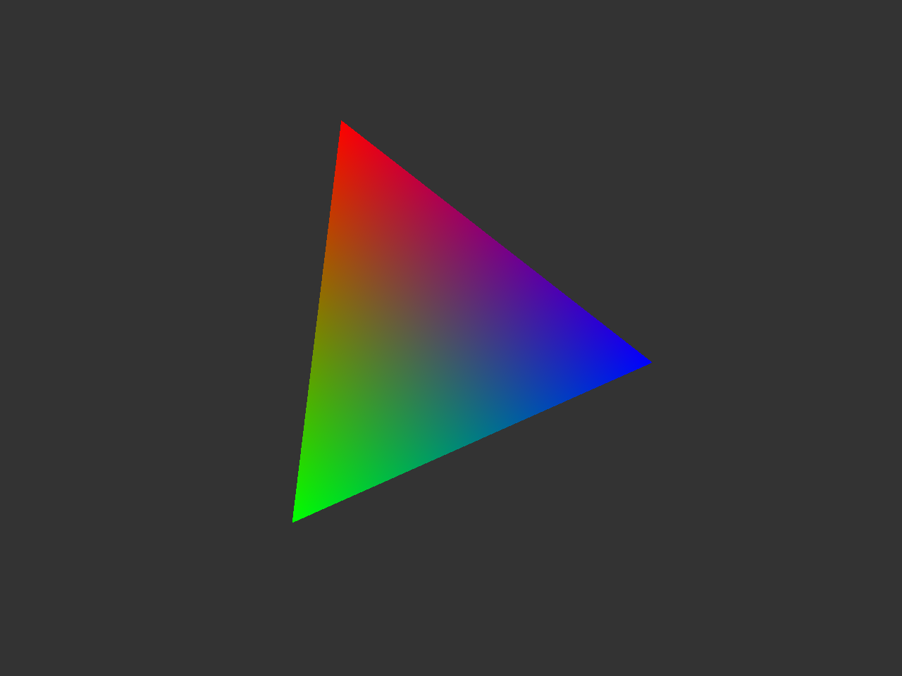

# learn-opengl

My code when going through the [Learn OpenGL Tutorial](https://learnopengl.com/). I use CLion as my IDE.

Clone with:

    git clone --recurse-submodules -j8 https://github.com/nixigaj/learn-opengl.git

